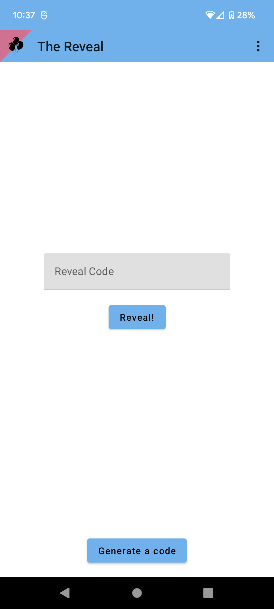
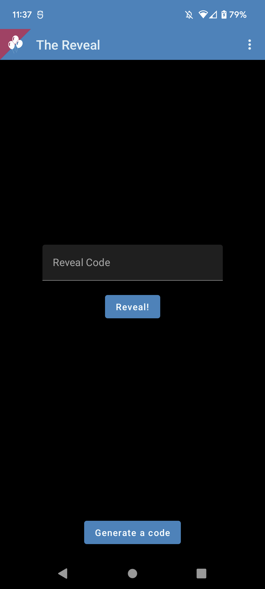
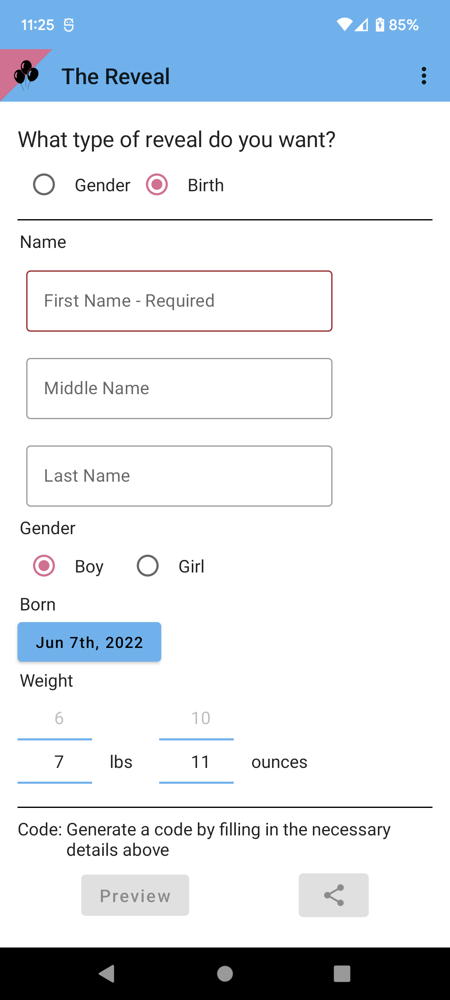
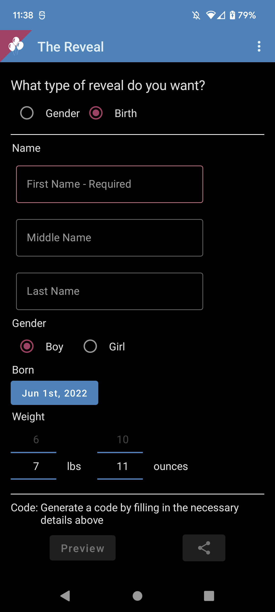
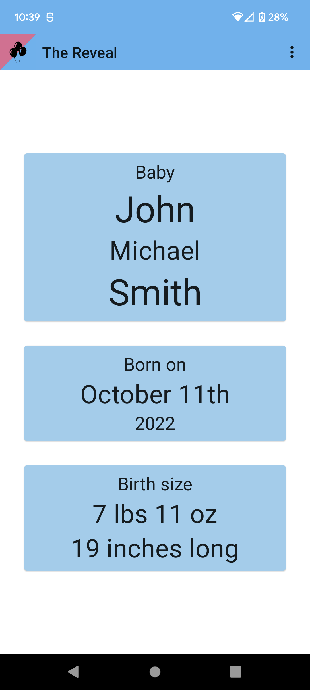
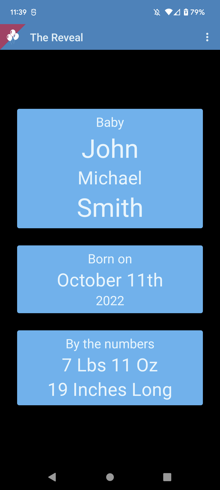
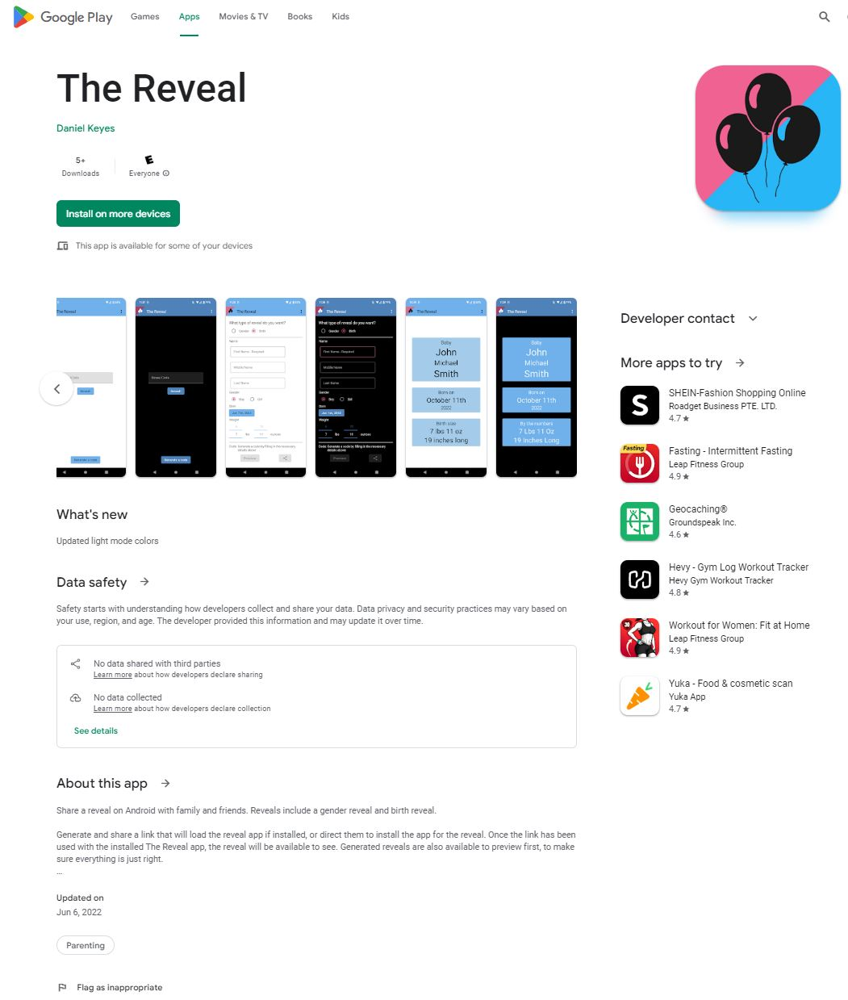
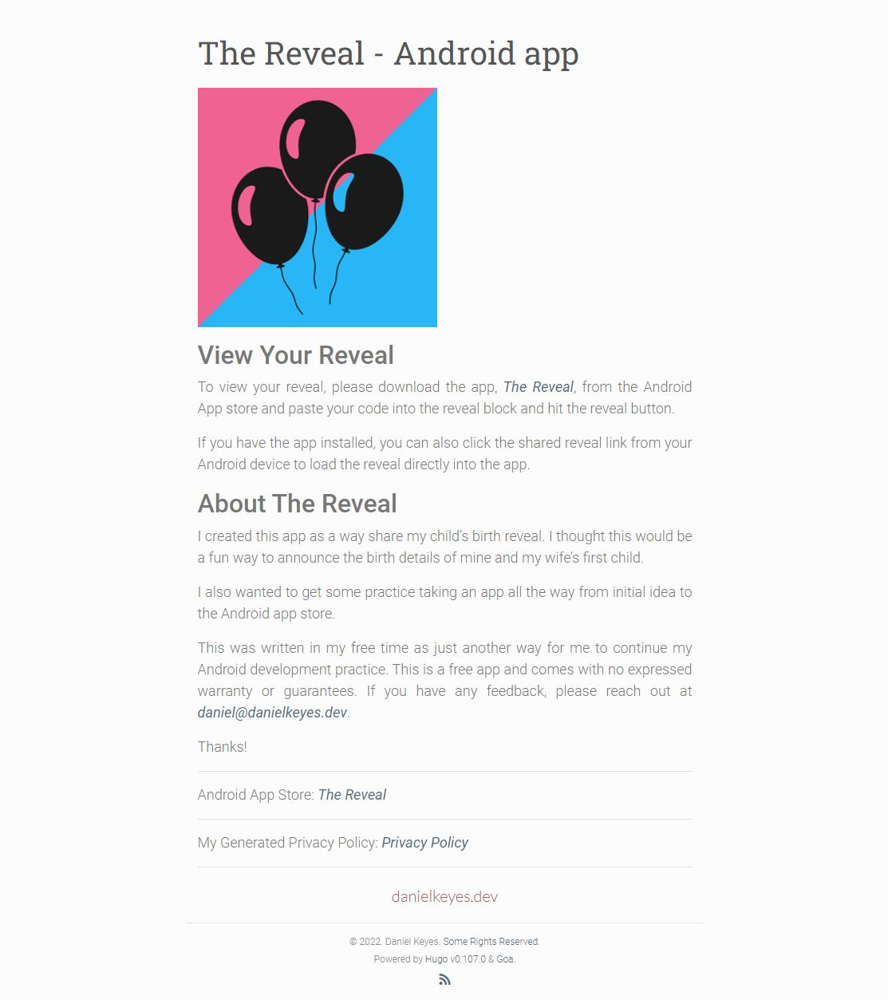
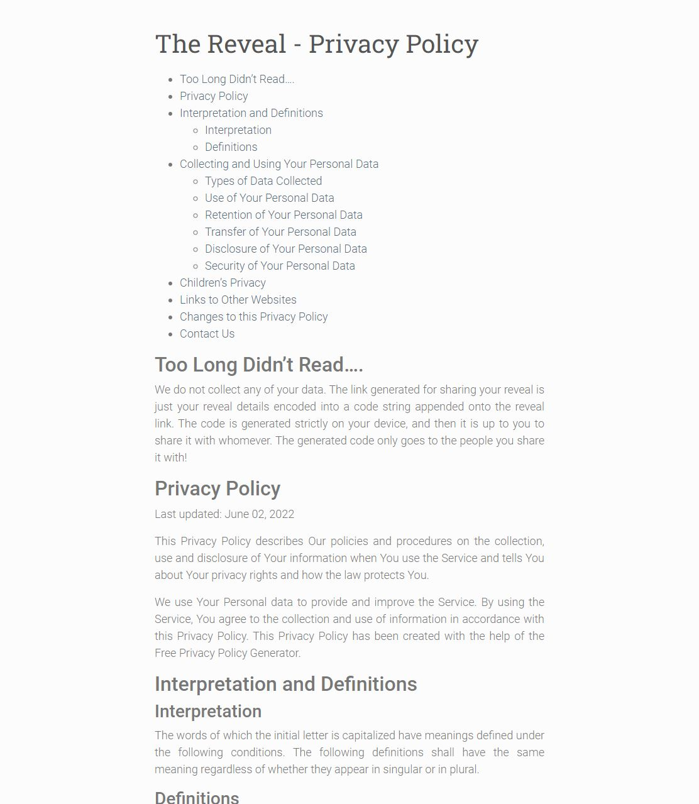

***This App has been removed from the Google Playstore and my website as I made it just for family and friends as way to announce my child's birth and do some coding in my freetime. It has served it's purpose.***

***All commit history has been squashed after removing any sensitive information from the project as well***

# The Reveal - Android App

This app can be used to either generate or enter a reveal code/reveal link that is used to do a gender reveal or birth reveal.

If the link is shared and the app is installed, the app will automatically read the code and do the reveal, else the link will open to The Reveal App website with explanation and a link to the Google Play Store listing.

# App Screenshots

### Main Page 

  

### Generate Reveal Page

  

### Reveal Page

  

# Previously published (REMOVED)

## Listing

## Website

## Practice Technologies

- **App Store publishing** - Wanted to do it at least once to see it from the google play side of things
- **Android App Links** - this one was fun because it required me to create a digital assets link, host it on my website, and test the link generated by the app that is then shared through text. This link would either open my app and prefill or direct them to my website if no app found where I could give a description and link to the play listing.
- **Deep Links** 
- **Digital Assets Link**

## Future Considerations

While this app was fun to get delivered and working, I don't think I would do something of this nature again, as we are one and done on having kiddos....

